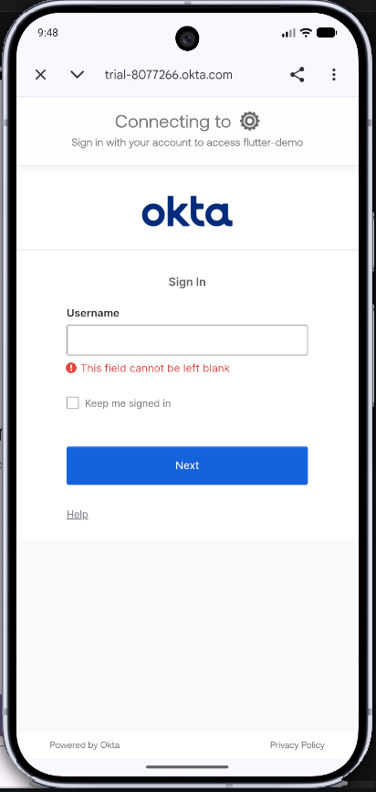
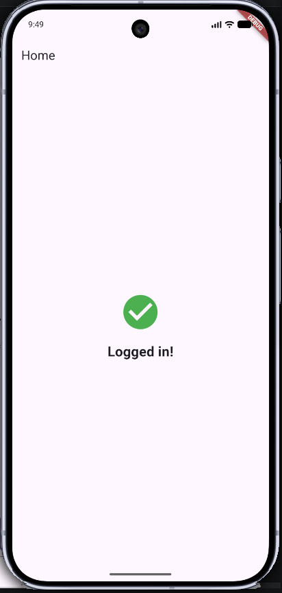

# Login Flow

This walkthrough shows what happens — on screen and under the hood — when a user taps **Login**.

---

## Step 1 — Welcome screen


The app opens on the `SplashScreen`. The **Login** and **Sign Up** buttons are disabled until `EnvironmentCubit` finishes loading the `.env` values. Once the domain and client ID are available, an `AuthClient` instance is created and the buttons become active.

Tap **Login** to start the OAuth flow.

---

## Step 2 — Okta hosted login page



Tapping **Login** calls `AuthClient.loginRedirect()`, which:

1. Generates a **code verifier** — a random secret kept in memory.
2. Derives a **code challenge** — the SHA-256 hash of the verifier. This is what gets sent to Okta; the verifier never leaves the app.
3. Generates a **state** value — a random token to guard against CSRF attacks.
4. Opens Okta's `/oauth2/default/v1/authorize` endpoint in an **in-app browser** using `url_launcher`.

The user is now on Okta's hosted Sign In page (notice the `trial-8077266.okta.com` URL bar). Okta owns and validates the credentials here — the app never sees the username or password.

---

## Step 3 — Callback (behind the scenes)

After the user submits their credentials, Okta redirects the browser to:

```
com.okta.trial-8077266:/callback?code=<authorization_code>&state=<state>
```

This is a **custom URL scheme** registered with the OS. Android/iOS recognise it, close the browser, and route the URI back to the app via a native `MethodChannel`. `SplashScreen` receives it through either:

- `onLink` — if the app was already running in the background
- `getInitialLink` — if the OS launched the app cold to handle the link

`_handleCallbackUri()` then calls `AuthClient.handleCallback()`, which POSTs the code and the original verifier to Okta's token endpoint:

```
POST https://trial-8077266.okta.com/oauth2/default/v1/token
  grant_type=authorization_code
  code=<authorization_code>
  redirect_uri=com.okta.trial-8077266:/callback
  client_id=<OKTA_CLIENT_ID>
  code_verifier=<the secret from Step 2>
```

Okta hashes the verifier and checks it against the challenge it stored earlier. If they match, it returns `access_token`, `id_token`, and `refresh_token`. The verifier is discarded immediately after so it cannot be reused.

---

## Step 4 — Home screen



On a successful token exchange the app navigates to `HomeScreen`, confirming the user is authenticated.
