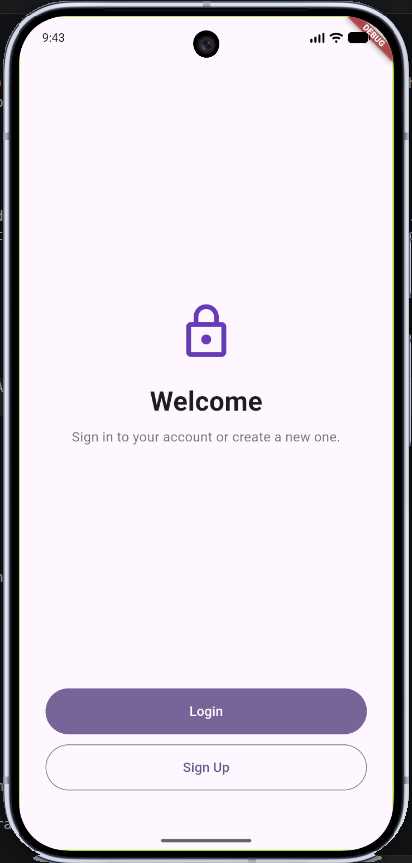
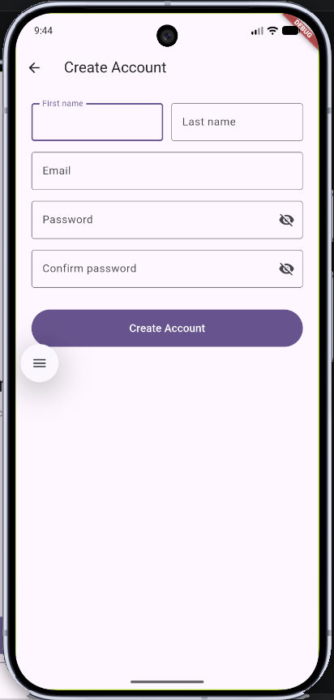

# Registration Flow

This walkthrough shows what happens — on screen and under the hood — when a user taps **Sign Up**.

---

## Step 1 — Welcome screen



The app opens on the `SplashScreen`. Tap **Sign Up** to navigate to the Create Account form. The button is disabled until `EnvironmentCubit` has finished loading the `.env` values (domain and API token are needed to call the Okta Users API).

---

## Step 2 — Create Account form



`SignupScreen` collects five fields: first name, last name, email, password, and password confirmation. All validation runs locally before any network request is made:

- Name fields must not be empty.
- Email must match a basic `user@domain.tld` pattern.
- Password must be at least 8 characters.
- Confirm password must match the password field exactly.

Tap **Create Account** to submit.

---

## Step 3 — User creation (behind the scenes)

`AuthClient.signup()` posts directly to the **Okta Users API**:

```
POST https://<OKTA_DOMAIN>/api/v1/users?activate=true
Authorization: SSWS <OKTA_API_TOKEN>
Content-Type: application/json

{
  "profile": {
    "firstName": "...",
    "lastName": "...",
    "email": "...",
    "login": "..."   ← Okta uses email as the username
  },
  "credentials": {
    "password": { "value": "..." }
  }
}
```

Key points:

- **`activate=true`** — activates the account immediately so the user can log in without waiting for an email confirmation.
- **`SSWS` auth scheme** — this is Okta's proprietary token format for its Management API, different from the OAuth `Bearer` tokens the login flow produces.
- **`login` = `email`** — Okta requires a unique `login` field (the username). Using the email address keeps things simple.

A `200` or `201` response means the account was created successfully. Any other status code returns an error from Okta's `errorSummary` field and displays it as a snackbar.

---

## Step 4 — Back to login

On success, a snackbar confirms the account was created and the app navigates back to the Welcome screen. The user can now tap **Login** to authenticate with the credentials they just registered.

See [LOGINFLOW.md](LOGINFLOW.md) for the full login walkthrough.
